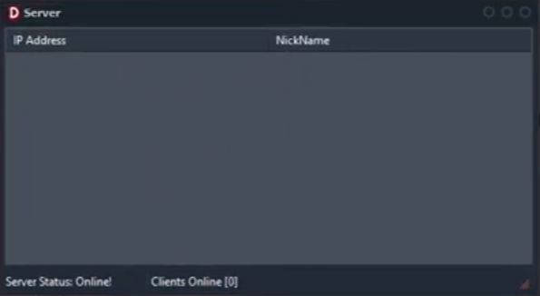

<h1>Delphi TMS FNC WebSocket Server Application Multiple Connection Handling Example</h1>

This Delphi VCL application demonstrates a WebSocket server using the <code>TMSFNCWebSocketServer</code> component from the TMS FNC libraries. The server can handle multiple client connections, broadcast messages, and send targeted messages to specific Clients.

<!-- Replace 'screenshot.png' with the path to your actual image file -->

  

<h2>Features</h2>
<ul>
  <li><strong>Client Management:</strong> Tracks connected clients and updates the list view.</li>
  <li><strong>Broadcast Messaging:</strong> Sends messages to all connected clients.</li>
  <li><strong>Targeted Messaging:</strong> Sends messages to a specific client selected from the list view.</li>
</ul>

<h2>Components</h2>
<ul>
  <li><code>TTMSFNCWebSocketServer:</code> Manages WebSocket server communications.</li>
  <li><code>TListView (scListView1, scListView2):</code> Displays connected clients and additional information. (Cilent Nickname)</li>
  <li><code>TStatusBar (scStatusBar1):</code> Shows server status and connected client count.</li>
  <li><code>TPopupMenu (PopupMenu1):</code> Provides options for broadcasting messages or sending targeted messages.</li>
</ul>

<h2>Usage</h2>
<ol>
  <li><strong>Start the Application:</strong> Run the Delphi project to start the WebSocket server.</li>
  <li><strong>Connect Clients:</strong> Clients can connect to the server using the specified port (3434).</li>
  <li><strong>Broadcast Message:</strong> Use the context menu option <code>S1</code> to send a message to all connected clients.</li>
  <li><strong>Send to Selected Client:</strong> Use the context menu option <code>S2</code> to send a message to a specific client selected from the <code>TListView</code>.</li>
  <li><strong>View Client Information:</strong> Click on a client in <code>scListView1</code> to view and update their information in <code>scListView2</code>.</li>
</ol>

<h2>Dependencies</h2>
<ul>
  <li><code>Delphi RAD Studio:</code> Required for compiling and running the project.</li>
  <li><code>TMS FNC Components:</code> Includes the <code>TTMSFNCWebSocketServer</code> component for WebSocket functionality.</li>
  <li><code>PNGImage:</code> For handling PNG image files.</li>
</ul>

<h2>License</h2>

This project is provided "as is", without warranty of any kind.

Built with Delphi RAD Studio with ❤️ by BitmasterXor.

